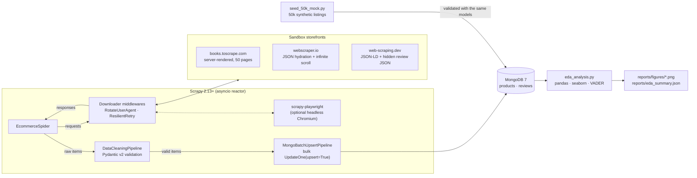
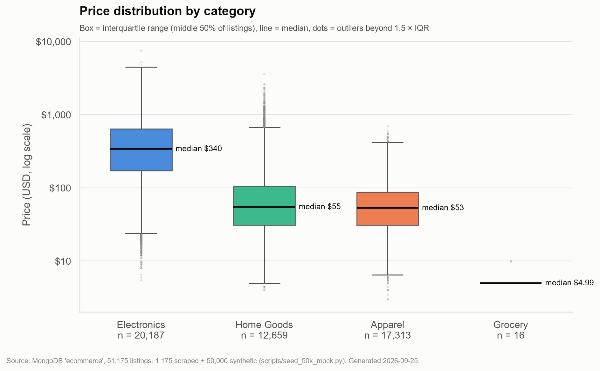
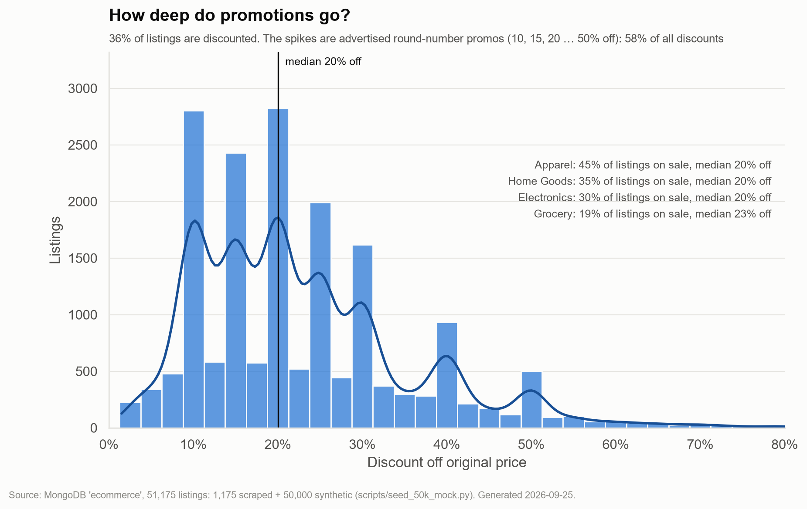
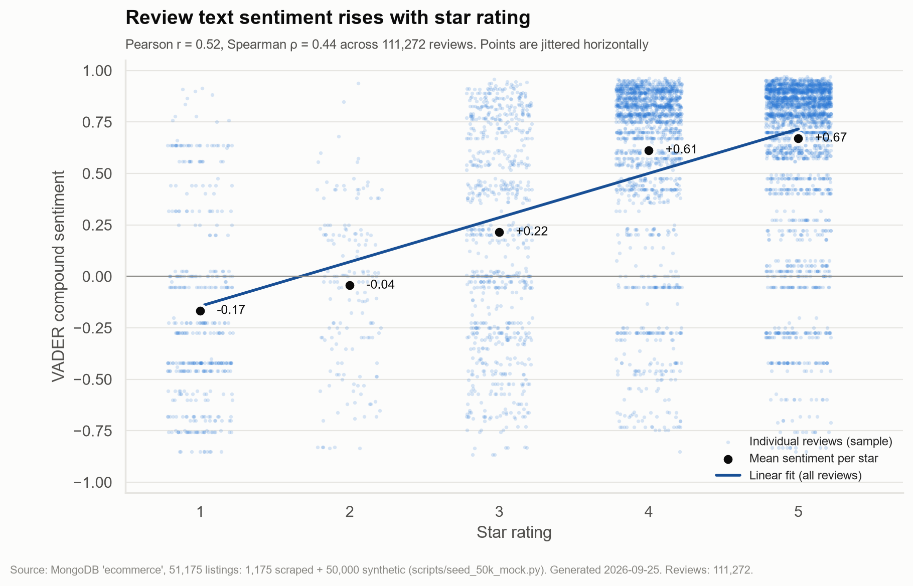
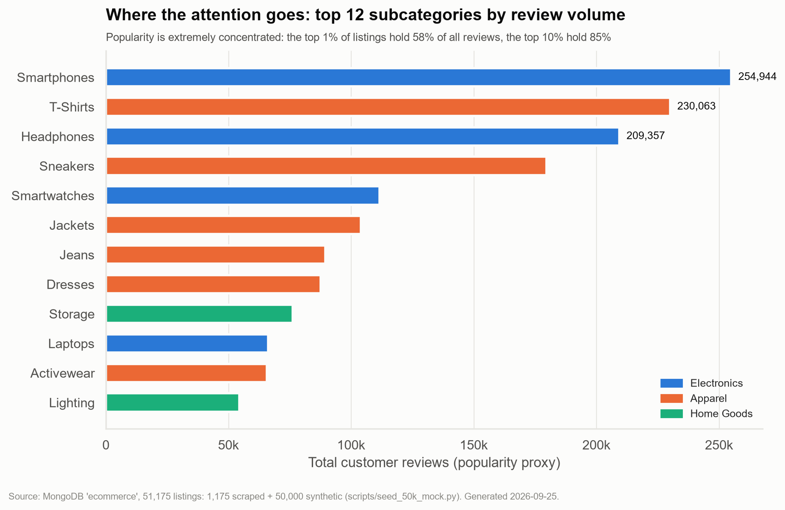
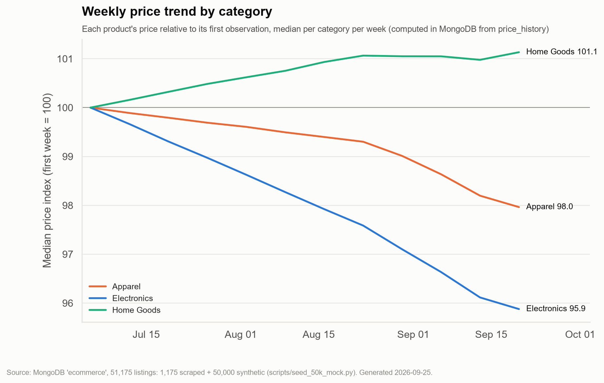

# E-Commerce Data Pipeline & Analysis

An end-to-end pipeline that **scrapes** product listings and reviews with Scrapy, **cleans and validates**
them with Pydantic v2, **stores** them idempotently in MongoDB, and **analyses** pricing, discounting,
popularity and review sentiment with pandas, seaborn and NLTK's VADER.

It crawls three public e-commerce sandboxes built for scraping practice, each chosen to exercise a
different extraction technique, and ships a 50,000-product synthetic catalogue so the storage layer,
the indexes and the analysis can be exercised at scale in about a minute.

| | Measured result |
|---|---|
| Live crawl | **1,175 products + 129 review records** from 3 storefronts in 5 min 31 s; every item passed schema validation; 0 errors |
| Re-crawl | 28 / 28 products **updated in place, 0 inserted** (idempotent upserts); each gained a `price_history` point |
| Headless rendering | 147 / 147 products recovered from infinite-scroll pages via Playwright; 57 image/font requests blocked |
| Scale benchmark | **50,000 products + 111,216 reviews** generated, validated and bulk-loaded in 23 s (8-core laptop, 4 workers) |
| Analysis | 5 figures + a JSON summary from 51,175 listings / 111,272 reviews in ~60 s |
| Quality | 123 tests (parsers, middlewares, validation, storage against real MongoDB, analysis), flake8 clean, GitHub Actions CI |

> **Data provenance.** The 1,175 scraped listings come from sandboxes whose catalogues are small by design
> (books.toscrape.com even assigns its prices and ratings at random). The 50,000-listing figures use
> synthetic data from [`scripts/seed_50k_mock.py`](scripts/seed_50k_mock.py). Every synthetic document is
> tagged `is_synthetic: true`, every chart footnote states the mix, and `--exclude-synthetic` reruns the
> analysis on scraped data alone. Findings on the synthetic set describe the generator's assumptions,
> not a real market; they show what the analysis surfaces.

---

## Architecture



**Data flow.** The spider only extracts raw strings. All cleaning rules live in the Pydantic models, so live
crawls and the synthetic seed pass through identical validation. Invalid items are dropped and counted per
field in the crawl stats (`cleaning/errors/<Model>/<field>`). Valid items are buffered and flushed to MongoDB
as unordered bulk upserts.

---

## Quickstart

### Docker (MongoDB 7 + app)

```bash
docker compose up -d            # MongoDB, then: indexes -> 50k seed -> EDA (runs once, then exits)
docker compose logs -f app      # figures land in ./reports/figures
```

Crawl the live sandboxes into the same database:

```bash
docker compose run --rm -w /app/scraper_engine app scrapy crawl ecommerce
```

Headless rendering needs Chromium in the image (about 400 MB with its system libraries):

```bash
INSTALL_PLAYWRIGHT=true docker compose build app
docker compose run --rm -e ENABLE_PLAYWRIGHT=1 -w /app/scraper_engine app scrapy crawl ecommerce -a platforms=webscraper_io
```

### Local (Python 3.11+)

```bash
python -m venv .venv && source .venv/bin/activate      # Windows: .venv\Scripts\activate
pip install -r requirements.txt
cp .env.example .env                                   # optional; defaults point at localhost:27017
docker compose up -d mongo

python scripts/setup_mongo.py                          # create indexes (idempotent)
python scripts/seed_50k_mock.py                        # 50k products + ~111k reviews
python analysis/eda_analysis.py                        # figures + reports/eda_summary.json
cd scraper_engine && scrapy crawl ecommerce            # live crawl of all three sandboxes
```

Useful spider arguments:

```bash
scrapy crawl ecommerce -a platforms=books_toscrape,web_scraping_dev   # subset of platforms
scrapy crawl ecommerce -a max_pages=2                                  # cap listing pagination
scrapy crawl ecommerce -O items.jsonl                                  # also export a feed
ENABLE_PLAYWRIGHT=1 scrapy crawl ecommerce -a platforms=webscraper_io  # render + infinite scroll
```

---

## Extraction: one spider, three techniques

| Platform | What makes it hard | How the spider handles it |
|---|---|---|
| `books_toscrape` | 1,000 products behind 50 paginated listing pages; prices in GBP; stock and rating hidden in CSS classes and text (`star-rating Three`, `In stock (22 available)`) | Follows `li.next` pagination, then detail pages. The models parse the star word, the currency symbol and the stock count |
| `webscraper_io` | The product grid is rendered by JavaScript; the static HTML has no product cards | **Default:** reads the JSON payload the page's JavaScript renders from (`data-items`): one request per category, no browser. **Headless:** renders the infinite-scroll variant in Chromium and scrolls until the grid stops growing. Stock comes from disabled variant buttons |
| `web_scraping_dev` | Reviews are injected client-side; the "Load more" API needs a CSRF header; robots.txt sets `Crawl-delay: 2` | Parses schema.org **JSON-LD** for price, rating and availability, and the hidden `<script id="reviews-data">` JSON for reviews (falling back to JSON-LD reviews). A per-domain download slot enforces the 2 s delay |

A generic JSON-LD reader (`iter_json_ld`, which handles `@graph` containers and lists) makes adding a real
storefront mostly a matter of choosing a start URL, because most retailers publish `Product` markup for SEO.

---

## Cleaning & validation (Pydantic v2)

[`models.py`](scraper_engine/scraper_engine/models.py) defines strict `ProductModel` / `ReviewModel` schemas
(`extra="forbid"`, bounded numerics, URL validation). Their `mode="before"` validators do the cleaning:

| Raw scraped value | Stored value |
|---|---|
| `"$1,299.99 USD"` / `"1.299,99 €"` / `"£51.77"` | `1299.99` + `USD` / `1299.99` + `EUR` / `51.77` + `GBP` (mojibake repaired) |
| `"-5.00"`, `"Call for price"` | rejected: price must be > 0 |
| `"3 weeks ago"`, `"Reviewed in the United States on July 22, 2022"` | timezone-aware UTC datetimes (stored as BSON dates, serialised as ISO 8601) |
| `"star-rating Three"`, `"4.5 out of 5 stars"`, `"4,7"` | `3.0`, `4.5`, `4.7` |
| `"In stock (22 available)"`, `"https://schema.org/OutOfStock"` | `in_stock=True, stock_quantity=22`, `in_stock=False` |
| `"Home > Computers / Laptops"`, `"consumables"` | `("Electronics", "Laptops")`, `("Grocery", "Consumables")` via a shared taxonomy |
| `original_price <= price` | dropped: a "was" price below the current price is not a discount |
| `<b>Caf&eacute;</b>​` | `Café` (entities, tags, zero-width characters and whitespace cleaned) |

`discount_pct` is a computed field. `tests/test_validation.py` asserts that the Scrapy `Item` fields and the
model fields never drift apart.

---

## Storage (MongoDB)

**Idempotent upserts.** `MongoBatchUpsertPipeline` buffers `UpdateOne(filter=natural_key, upsert=True)`
operations and runs `bulk_write(ordered=False)` when a buffer reaches **500 operations**, every **5 seconds**
(a Twisted `LoopingCall`, so a slow crawl still lands data), and on spider close. Write errors are counted
in the crawl stats instead of crashing the crawl.

| Collection | Natural key (unique index) | Why |
|---|---|---|
| `products` | `(platform, sku_id)` | a listing is unique per storefront |
| `reviews` | `(platform, sku_id, review_id)` | storefronts **syndicate one review across variants**. On web-scraping.dev all 56 review ids appear on more than one product. A global review key silently overwrote 73 of 129 reviews until this was caught |

Each product upsert also appends to a capped `price_history` array (`$push` + `$slice: -52`) and sets
`first_seen_at` with `$setOnInsert`. Repeated crawls therefore build a price time series, and the documents
are never duplicated.

**Indexes** ([`scripts/setup_mongo.py`](scripts/setup_mongo.py), defined in
[`storage.py`](scraper_engine/scraper_engine/storage.py)):

| Collection | Index | Serves |
|---|---|---|
| products | `{platform: 1, sku_id: 1}` unique | upserts |
| products | `{category: 1, price: 1}` | category pages sorted/filtered by price (verified with `explain()`) |
| products | `{rating: -1}` | top-rated listings |
| products | `{title: "text"}` | keyword search: `db.products.find({$text: {$search: "wireless earbuds"}})` |
| reviews | `{platform: 1, sku_id: 1, review_id: 1}` unique | upserts |
| reviews | `{platform: 1, sku_id: 1, date: -1}` | newest reviews for a product |
| reviews | `{rating: 1}` | rating breakdowns |

<details>
<summary>Example documents (real, from the web-scraping.dev crawl)</summary>

```json
{
  "platform": "web_scraping_dev", "sku_id": "1",
  "title": "Box of Chocolate Candy", "brand": "ChocoDelight",
  "url": "https://web-scraping.dev/product/1",
  "category": "Grocery", "subcategory": "Consumables",
  "price": 9.99, "original_price": 12.99, "discount_pct": 23.09, "currency": "USD",
  "rating": 4.7, "review_count": 10, "in_stock": true,
  "price_history": [
    {"price": 9.99, "original_price": 12.99, "observed_at": "2026-09-25T01:55:41Z"},
    {"price": 9.99, "original_price": 12.99, "observed_at": "2026-09-25T02:04:30Z"}
  ],
  "first_seen_at": "2026-09-25T01:55:41Z", "last_seen_at": "2026-09-25T02:04:30Z"
}
```

```json
{
  "platform": "web_scraping_dev", "sku_id": "1", "review_id": "chocolate-candy-box-5",
  "author": "Anonymous", "rating": 4, "verified_purchase": false,
  "review_text": "A bit pricey, but the quality of the chocolate is worth it.",
  "date": "2022-11-05T00:00:00Z"
}
```
</details>

---

## The 50k scale benchmark

`python scripts/seed_50k_mock.py` generates a catalogue across Electronics, Apparel and Home Goods on three
fictional storefronts (`*.example.com`) with realistic structure:

- **log-normal prices** per subcategory, charm pricing (x.99) and brand premiums
- **promotions**: advertised round-number promos (10/15/20…50 % off) mixed with continuous markdowns;
  Apparel runs the most promotions
- **power-law popularity**: a few products hold most reviews
- **J-shaped star ratings**, and review text whose sentiment mostly agrees with the stars. Mixed,
  mismatched and sarcastic reviews are included on purpose
- **12 weeks of price history** with category-level drift

Records are emitted as raw, scraped-looking strings (`"$1,299.99"`, `"3 weeks ago"`) and validated through the
same Pydantic models before a chunked, multithreaded `insert_many(ordered=False)`. Generation runs across
worker processes with per-chunk seeds from `SeedSequence.spawn`, so a given `--seed` produces identical data
regardless of `--workers`. Re-running replaces only `is_synthetic` documents.

| Step (8-core laptop) | Time |
|---|---|
| Generate + validate 50,000 products and 111,216 reviews (4 processes) | 17.6 s |
| Bulk insert (4 threads, 5,000-doc batches) | 5.5 s (~29,000 docs/s) |
| Full EDA incl. VADER over 111k reviews | ~60 s |

---

## Analytical findings

Figures are produced by [`analysis/eda_analysis.py`](analysis/eda_analysis.py), which queries MongoDB straight
into pandas. The weekly price index is computed **server-side** with `$unwind` + `$dateTrunc` + `$median`.
Every number below comes from [`reports/eda_summary.json`](reports/eda_summary.json). Per the provenance note
above, the 50k-scale patterns reflect the synthetic generator, and the scraped-only results are listed
separately.

### 1. Pricing: category sets the price level, and the tails are long



- Electronics has a median of **$339.99** and an interquartile range of **$171–$640**, over 6× the medians
  of Home Goods ($54.74) and Apparel ($52.99).
- Every category is right-skewed: Home Goods' mean ($113.84) is about **2× its median**, pulled up by a
  furniture tail. Medians and IQRs describe a typical listing better than means do.

### 2. Discounting: promotions cluster on round numbers



- **36.3 %** of listings are discounted; the median discount is **20 %** and the 90th percentile is **40 %**.
- **57.6 %** of discounts are exact round numbers (10, 15, 20 … 50 %), which appear as spikes above the
  continuous markdown curve.
- Apparel is the most promoted category (45 % of listings on sale) and Electronics the least (30 %).

### 3. Customer sentiment: text agrees with stars, up to a point



- VADER compound sentiment correlates with star rating at **Pearson r = 0.52** (Spearman ρ = 0.44) across
  111,272 reviews, rising from **−0.17** at 1★ to **+0.67** at 5★.
- 4★ and 5★ reviews read almost the same (+0.61 vs +0.67), so the text barely separates the top ratings.
- **26.8 % of 1–2★ reviews score positive.** Sarcasm ("Great, it broke after two days") and mixed
  reviews fool lexicon models. For production, a fine-tuned transformer or aspect-based sentiment is worth
  its cost.
- On **real** review text (the 56 unique reviews scraped from web-scraping.dev), the correlation is
  **r = 0.62**, and 5★ reviews average **+0.82**.

### 4. Product popularity: attention is highly concentrated



- The **top 1 % of listings hold 58.5 % of all reviews** and the top 10 % hold 84.6 %; 32 % of listings
  have none.
- Review volume is uncorrelated with rating (Spearman ρ ≈ 0.01): popularity measures exposure, not quality.
- Smartphones, T-Shirts and Headphones lead review volume.

### 5. Price trends: 12 weeks of `price_history`



- Median price index over 12 weeks: Electronics **−4.1 %**, Apparel **−2.0 %** (falling faster in the last
  month as promotions start), Home Goods **+1.1 %**.
- Live crawls feed the same chart: every re-crawl appends a price observation per product, so the trend
  fills in with real data as crawls are scheduled.

Scraped-only figures and summary: [`reports/figures/scraped_only/`](reports/figures/scraped_only) and
[`reports/eda_summary_scraped_only.json`](reports/eda_summary_scraped_only.json). The 1,000 books are
priced in GBP and are excluded from the USD price charts rather than converted at an arbitrary rate.

---

## Anti-scraping countermeasures & dynamic content

This project scrapes sites that invite it, and its techniques aim to be **low-impact and hard to mistake
for abuse**. They are not built to defeat a site that says no.

### Rate limits: slow down before you're told to

- `ROBOTSTXT_OBEY = True`. Scrapy does not enforce `Crawl-delay`, so web-scraping.dev's is applied through
  a per-domain `DOWNLOAD_SLOTS` entry (1 concurrent request, 2 s delay), and AutoThrottle is told not to
  lower it (`autothrottle_dont_adjust_delay`).
- AutoThrottle adapts the delay to server latency, on top of `CONCURRENT_REQUESTS = 16`,
  `DOWNLOAD_DELAY = 0.25` with ±50 % jitter, and 8 requests per domain at most.
- **`ResilientRetryMiddleware`** handles 429 / 503 / 403. Sleeping would block Twisted's reactor, so it
  instead raises the **download slot's delay**, which slows the whole domain, the level at which rate
  limits apply. The delay follows equal-jitter exponential backoff (`base · 2^attempt`, half fixed and half
  random, capped at 60 s), or the server's `Retry-After` when present. The request is re-queued with a
  priority penalty, and the slot delay recovers gradually as healthy responses return. A **soft-block
  detector** also treats 200-status interstitials ("Just a moment…", "Robot check") as blocks.

### Identity: consistent beats random

- **`RotateUserAgentMiddleware`** draws from a pool of current Chrome, Edge, Firefox and Safari identities,
  on desktop and mobile. Chromium identities carry matching `Sec-CH-UA*` client hints; Firefox and Safari
  send none, as real browsers do. A Chrome UA without client hints is a cheap tell.
- **Limits:** the user agent is the weakest signal. Modern bot management (Cloudflare, Akamai, DataDome)
  fingerprints TLS (JA3/JA4), HTTP/2 settings and the JavaScript environment, so a Python client with a
  Chrome UA can still be identified from its TLS handshake alone. Rotating per request also looks less
  like one browser than keeping one identity per session does. Per-request rotation is used here because
  it spreads load across identities for sites that key rate limits on the UA.
- **IP-based limits:** the project doesn't rotate proxies. Staying under a site's limits, caching
  (`HTTPCACHE_ENABLED=1`) and incremental re-crawls cost less than a proxy pool and cause fewer problems.

### CAPTCHAs: avoid triggering them, never solve them

CAPTCHAs are mostly triggered by bursty, uniform, header-poor traffic, which the throttling and
consistent identities above avoid. When a challenge page does appear, the crawler backs off and eventually
gives up (`resilient_retry/gave_up` in the stats). It doesn't solve or bypass CAPTCHAs: a challenge is the
site's answer, and the right response is to slow down, use an official API or feed, or stop.

### Dynamic content: the cheapest method that works

| Approach | Cost | Used for |
|---|---|---|
| **Embedded data**: JSON-LD, `data-*` hydration payloads, `<script type="application/json">` | 1 HTTP request, no browser; stable, because it's a machine-readable contract | webscraper.io grid (`data-items`), web-scraping.dev prices and reviews |
| **Replay the XHR**: call the JSON endpoint the page calls, with its CSRF token | Cheap, but coupled to a private API | Investigated for web-scraping.dev's paginated reviews API, which returned HTTP 500 during development, so the embedded JSON is used |
| **Headless browser** (scrapy-playwright) | Orders of magnitude more CPU and memory; seconds per page (a full scroll of the laptops grid took ~21 s) | Opt-in (`ENABLE_PLAYWRIGHT=1`): the webscraper.io infinite-scroll grid; images, media and fonts are blocked to cut cost |

The scroll routine stops only after the page height has been stable for 3 consecutive checks. An earlier
version stopped after one unchanged check and missed lazily appended cards; it was verified against the
live page (117 / 117 cards).

---

## Project structure

```text
├── docker-compose.yml             MongoDB 7 (loopback only) + app service
├── Dockerfile                     python:3.12-slim, non-root, VADER lexicon baked in, optional Chromium
├── requirements.txt / .env.example / setup.cfg (flake8 + pytest config)
├── .github/workflows/pipeline_ci.yml   flake8 + pytest (3.11, 3.12) with a MongoDB service; end-to-end job
├── scraper_engine/
│   ├── scrapy.cfg
│   └── scraper_engine/
│       ├── items.py               raw item containers (mirrors the models)
│       ├── models.py              Pydantic v2 schemas + cleaning helpers
│       ├── middlewares.py         RotateUserAgentMiddleware, ResilientRetryMiddleware
│       ├── pipelines.py           DataCleaningPipeline, MongoBatchUpsertPipeline
│       ├── storage.py             Mongo connection, natural keys, index definitions
│       ├── settings.py            politeness, middlewares, pipelines, optional Playwright
│       └── spiders/ecommerce_spider.py
├── scripts/
│   ├── setup_mongo.py             create + describe indexes
│   └── seed_50k_mock.py           synthetic 50k catalogue generator + bulk loader
├── analysis/eda_analysis.py       MongoDB -> pandas -> metrics, figures, JSON summary
├── reports/                       generated figures and summaries (committed so this README renders)
└── tests/                         123 tests
```

## Tests & CI

```bash
pytest            # storage tests need MongoDB (MONGO_TEST_URI, default localhost:27017); skipped if absent
flake8 .
```

- **Parsers** run against trimmed copies of the real sandbox markup (no network).
- **Middlewares:** UA / client-hint consistency, backoff growth and jitter bounds, `Retry-After` (seconds
  and HTTP-date), slot penalty and recovery, give-up behaviour, soft-block pages.
- **Validation:** 60+ dirty-input cases for prices, dates, ratings, stock and categories, plus rejection cases.
- **Storage:** batch-size and 5-second interval flushes (with a fake Twisted clock), idempotent re-runs,
  capped price history, syndicated reviews, write-error accounting, all against a real MongoDB. mongomock
  isn't used because it is incompatible with PyMongo ≥ 4.9's bulk API.
- **Analysis & generator:** metric functions, schema conformance, distribution shape, and determinism
  across worker counts.

CI ([`pipeline_ci.yml`](.github/workflows/pipeline_ci.yml)) runs lint and the full suite on Python 3.11 and
3.12 against a MongoDB 7 service container. An end-to-end job then creates indexes, seeds twice (asserting
the count doesn't double), runs the EDA, and uploads the figures as a build artifact.

## Limitations & next steps

- **Scale of live data.** The sandboxes cap the live crawl at ~1.2k listings. Pointing the JSON-LD path at
  a real retailer needs that site's permission and terms reviewed first.
- **Sentiment.** VADER is fast and transparent but misreads sarcasm and domain phrasing (see finding 3). A
  fine-tuned transformer or aspect-based model is the upgrade path.
- **Currency.** Non-USD listings are excluded from price charts. A dated FX table would allow conversion.
- **Scheduling.** Crawls are run by hand. A scheduler (cron, Airflow) running incremental crawls would turn
  `price_history` into real trend data.
